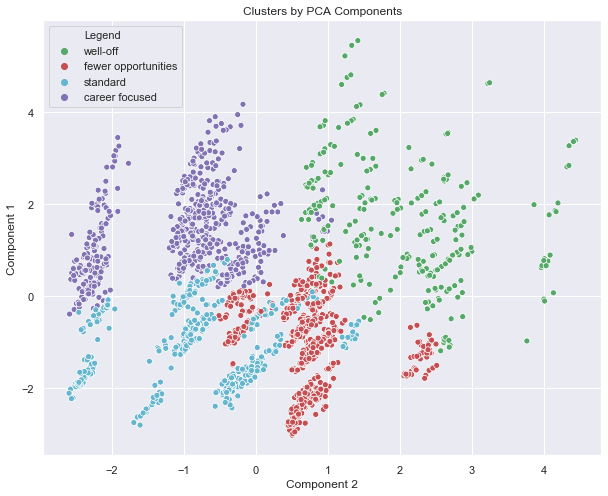

# FMCG-Customer-Analytics
Building a STP(Segmentation, Targeting and Positioning) model on B2C clients.

Techniques Involved:
1. K-means Clustering
2. PCA
3. Elasticity Modeling

Customer Analytics: The first part of the project focuses on how to perform customer segmentation,
using a hands-on approach. It involves the application of hierarchical and flat clustering techniques for
dividing customers into groups. It also features applying the Principal Components Analysis (PCA) to
reduce the dimensionality of the problem, as well as combining PCA and K-means for an even more
professional customer segmentation.

Purchase Analytics: The second part of the project explores both the descriptive and predictive
analysis of the purchase behaviour of customers, including models for purchase incidence, brand
choice, and purchase quantity

Steps:
Followed STP(Segmentation, Targeting and Positioning Framework)

SEGMENTATION
Here the data we have used is customer related data coming from the grocery store, each record is a customer 
1. Hierarchical Clustering and dendrogram
a. Device Based (Top Down)
b Agglomerative (Bottoms Up)  - More easy mathematically 
 i) Used ward method to calculate the distance between clusters
 
Rule of thumb:
We find the longest vertical line unintercepted by a horizontal line from the dendrogram. This is where we should make the cut.

For Visualization and some idea we started with Hierarchical clustering then we move to flat clustering called K-Means.

2. K means Clustering
a. Choose random number number of clusters
b. Specify cluster seeds (each cluster starting centroid) (inbuilt handled by kmeans method)
c. run the loop for all clusters and calculate Within-Cluster-Sum-of-Squares (WCSS). 
WCSS is the sum of squares of the distances of each data point in all clusters to their respective centroids
d. Used elbow method to find out the number of optimal clusters
e. Assing each datapoint to the nearest clusters (With help of Euclidean Distance)

Disadvantage
1. Outlier can make a seperate cluster, we can use K median clustering but that is computationally expensive
2. We have to choose inital number of clusters by ourselves

PCA with Kmeans
Reduced features into three components using dimensionality reduction technique
Below is the output of segmentation using Component 1 and Component 2

POSITIONING
Here data is a transaction based having details about 500 uniques individuals having details of purchasing on a daily basis
1. Purchase Probability
Will the customer buy a product from a particular product category 
2. Which brand is the customer going to choose
3. How many units will the customer plan to buy
